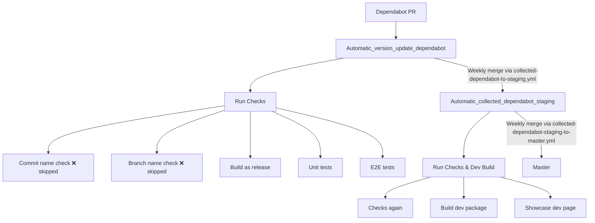

# Contributions
- conventions should be
	- jobs kebab case no caps
	- step names sentances
	- step ids snake case
	- envs all cap snake


# Scripts

## Dev

### Overview
Dev Check Test Package TELBlazor.Components Trigger TELBlazor-DevShowCase Deployment

- Run checks from reeuseable ci checks workflow
- versions repo and package
- Artifact and workflow trigger for GH-Page deployment TELBlazor-DevShowCase

### Detail
- Uses Nugetkey token which is an organisational token
- the project at the solution level has a CICDPackageLocation folder the route to which is defined by ```LOCAL_PACKAGES_PATH : ${{ github.workspace }}/CICDPackageLocation``` 
	- This is the path we build the package to before giving it to the repo git package area
- ```dev-call-reusable-ci-checks-workflow``` just build checks and tests
- ```generate-dev-semantic-version```
	- ```    outputs:
		  dev-package-version: ${{ steps.set_dev_semantic_version.outputs.dev-semantic-version }}```
		- the id is used to reference what step is setting the value of dev-package-version
			- it is dev package version because we version the dev package versions seperately
	- npm installs sematic-release
	- we run npx sematic-release for the version
		- there can be no version if no change so then we just use the repo tag
		- we add the date too
		- the package version for dev does not need to be the right order it just needs to have one for easy development its the release version that matters
- next set_dev_semantic_version just adds a timestamp to the string
- build-telblazor-dev-package-and-publish
	- we use nuget.config.cicd as the nuget template which takes our environmental values via text replace
	- we clean lock files because there is about to be a version change
	- we build
		- build creates a partial which has the version in it which is useful for the ShowCase
		- The project has a flag that allows building to publish the Package
		- it uses the nuget output path to the CICD folder at solution level
	- We publish the Package
- trigger-gh-pages-telblazor-devshowcase-workflow
	- makes the showcase using the package

## Pull_Request
- just runs on all pull requests the Reuseable Ci Checks
- The pull request, and the branch rules to do the same checks currently. The advantage of the branch rules are that
they stay in the pull request ui. they are also only targetted on master
 
 
## Reuseable Ci Checks
- Checks should all run so if multiple fails can be resolved in one commit but still trigger a stopping error if any fail at the end of the workflow.

 
## Release
### Overview
- if there is a version change it updates
	- repo tag
	- packages with new package and version
	- TELBlazor-ShowCase site
### Detail

	
## dependabot
- npm and node
- seperate script to auto merge

## automerge-passing-minor-patch-dependabot-prs
- 

# Git setup

## Pull requests
- Branch checks for master dont work, they don't run the workflow dispatch.
If we want these checks one solution is every check in its own yml (they dont directly use Reuseable Ci Checks instead they use them via the pull_request yml)
The individual steps also automatically pass so can see if any error at the end with the check to check all their outputs

# Notes
- doesnt run easily with nektos act due to git ref checks and calling other workflows
- for tests use the run-tests-and-report-with-env-values.ps1 file
- dependabot duplicates tokens using dependabot secrets including write so can run checks
- autoverging is being tried for major and minor
- branch checks must pass for merge on automated_version
- checks required but overrideable for all workflows
- dependabot secret names to match repos ones where need to share
- dependabot not need to build package later brnch does

## Dependabot Pipeline (AI generatated diag)



## Versioning
Via semantic release and recorded as a generate c# file used by a blazor component

## Alternative Approaches


name: Pull Request Checks

# ⚠️ pull_request_target is dangerous it allows secrets to be used by forks and bots, ⚠️ 
# ⚠️ we want dependabot only to be using these secrets so addition logic requires an "if" for every job ⚠️
# We will restrict it by making pull_request_target only for the Automatic_version_update_dependabot and then use
# an if to ensure its only by dependabot

on:
  pull_request:
    branches: ['**']                # Run on all branches
    branches-ignore: ['dependabot/**']  # Skip Dependabot PRs
  pull_request_target:
    branches: ['Automatic_version_update_dependabot']  # Base branch for Dependabot PRs
  workflow_dispatch:
  
jobs:
  dummy:
    if: |
      (github.actor == 'dependabot[bot]' && 
      startsWith(github.head_ref, 'dependabot/') &&
      github.event_name == 'pull_request_target')
      ||
      (github.actor != 'dependabot[bot]' && github.event_name == 'pull_request')
    runs-on: ubuntu-latest
    steps:
      - name: Dummy Step
        run: echo "This is a dummy job to allow workflow_dispatch"
        
  pull-request-call-reusable-ci-checks-workflow:
    if: |
      (github.actor == 'dependabot[bot]' && 
      startsWith(github.head_ref, 'dependabot/') &&
      github.event_name == 'pull_request_target')
      ||
      (github.actor != 'dependabot[bot]' && github.event_name == 'pull_request')
    name: Pull Request run CI Checks
    uses: ./.github/workflows/reuseable-ci-checks.yml
    needs: dummy
    with:
      runall: true
      
    # could try secrets:inherit QQQQ
    secrets:
      UNITTESTS_APPSETTINGS_DEVELOPMENT: ${{ secrets.UNITTESTS_APPSETTINGS_DEVELOPMENT }}
      WASMSTATICCLIENT_APPSETTINGS_DEVELOPMENT: ${{ secrets.WASMSTATICCLIENT_APPSETTINGS_DEVELOPMENT }}
      WASMSERVERHOSTCLIENT_APPSETTINGS_DEVELOPMENT: ${{ secrets.WASMSERVERHOSTCLIENT_APPSETTINGS_DEVELOPMENT }}
      WASMSERVERHOST_APPSETTINGS_DEVELOPMENT: ${{ secrets.WASMSERVERHOST_APPSETTINGS_DEVELOPMENT }}
      TEL_GIT_PACKAGES_TOKEN: ${{secrets.NUGETKEY }}
      
      UNITTESTS_APPSETTINGS_PRODUCTION: ${{ secrets.UNITTESTS_APPSETTINGS_PRODUCTION }}
      WASMSTATICCLIENT_APPSETTINGS_PRODUCTION: ${{ secrets.WASMSTATICCLIENT_APPSETTINGS_PRODUCTION }}
      WASMSERVERHOSTCLIENT_APPSETTINGS_PRODUCTION: ${{ secrets.WASMSERVERHOSTCLIENT_APPSETTINGS_PRODUCTION }}
      WASMSERVERHOST_APPSETTINGS_PRODUCTION: ${{ secrets.WASMSERVERHOST_APPSETTINGS_PRODUCTION }}

```
